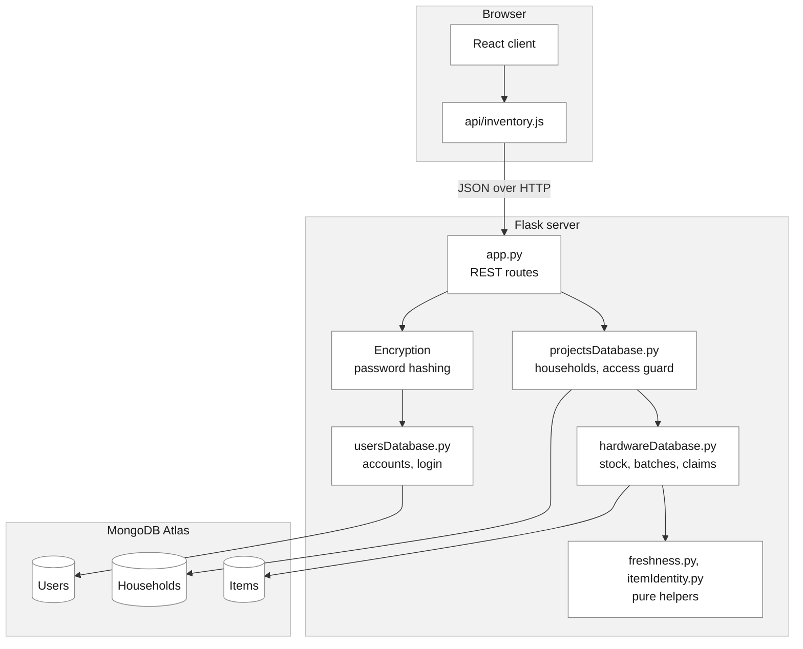
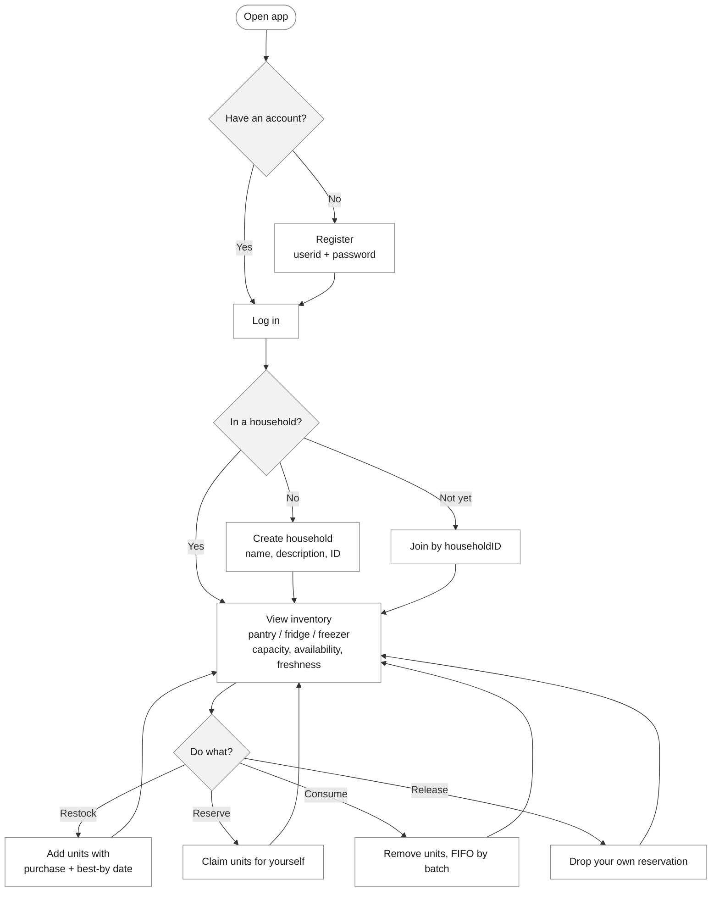

# PantryTrack: architecture sketch

**Group 2 (Monday) · ECE 461L Phase 1, R1-3**

PantryTrack is a web app for tracking shared food inventory in a household. The assignment's HaaS model maps onto the domain directly: a **household** plays the role of a project, and a **food item** plays the role of a hardware set, with `capacity` (total units stocked) and `availability` (units not yet claimed).

## Architecture

Three tiers. The React client never touches the database directly. Every value on screen comes back from a REST call. Credentials are encrypted on the way into the `Users` collection, and every inventory call passes through a household membership check before it can read or write stock.

The Flask server and the Atlas database are cloud-hosted, so the app is reachable by URL rather than run locally.

## User flow

Reserving is a heads-up to housemates, not a lock. It never blocks anyone else from consuming. Only the member who made a reservation can release it.
