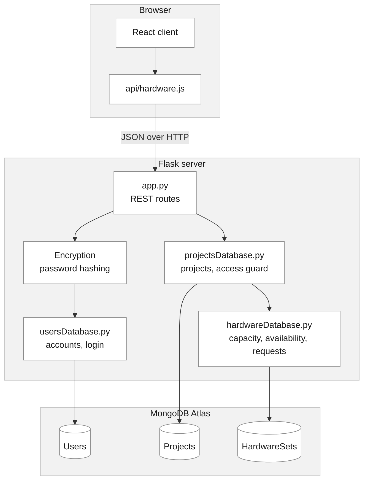
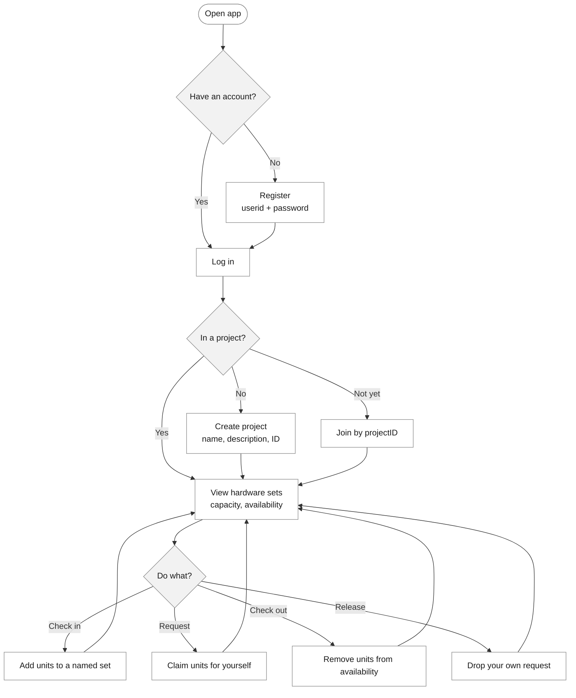

# HaaS Resource Manager: architecture sketch

**Group 2 (Monday) · ECE 461L Phase 1, R1-3**

A web app implementing the assignment's Hardware-as-a-Service (HaaS) domain directly: a
**project** plays the role of a project (unchanged), and a **hardware set** (e.g. HWSet1, HWSet2,
or any project-defined name) plays the role of a hardware resource, with `capacity` (total units
owned) and `availability` (units not yet requested or checked out).

## Architecture

```mermaid
flowchart TD
    subgraph browser["Browser"]
        UI["React client"]
        APICLIENT["api/hardware.js"]
    end

    subgraph server["Flask server"]
        ROUTES["app.py<br/>REST routes"]
        ENC["Encryption<br/>password hashing"]
        USERS["usersDatabase.py<br/>accounts, login"]
        PROJ["projectsDatabase.py<br/>projects, access guard"]
        HW["hardwareDatabase.py<br/>capacity, availability, requests"]
    end

    subgraph db["MongoDB Atlas"]
        UC[("Users")]
        PC[("Projects")]
        HC[("HardwareSets")]
    end

    UI --> APICLIENT
    APICLIENT -->|JSON over HTTP| ROUTES
    ROUTES --> ENC
    ENC --> USERS
    ROUTES --> PROJ
    PROJ --> HW
    USERS --> UC
    PROJ --> PC
    HW --> HC

    classDef plain fill:#ffffff,stroke:#8a8a8a,stroke-width:1px,color:#1a1a1a
    class UI,APICLIENT,ROUTES,ENC,USERS,PROJ,HW,UC,PC,HC plain
    style browser fill:#f2f2f2,stroke:#c0c0c0,color:#1a1a1a
    style server fill:#f2f2f2,stroke:#c0c0c0,color:#1a1a1a
    style db fill:#f2f2f2,stroke:#c0c0c0,color:#1a1a1a
```

Three tiers. The React client never touches the database directly. Every value on screen comes
back from a REST call. Credentials are encrypted on the way into the `Users` collection, and
every hardware-resource call passes through a project-membership check before it can read or
write a hardware set.

The Flask server and the Atlas database are cloud-hosted, so the app is reachable by URL rather
than run locally.

## User flow

```mermaid
flowchart TD
    START([Open app]) --> AUTH{Have an account?}
    AUTH -->|No| REG["Register<br/>userid + password"]
    AUTH -->|Yes| LOGIN["Log in"]
    REG --> LOGIN
    LOGIN --> PROJ{In a project?}
    PROJ -->|No| CREATE["Create project<br/>name, description, ID"]
    PROJ -->|Not yet| JOIN["Join by projectID"]
    PROJ -->|Yes| VIEW
    CREATE --> VIEW
    JOIN --> VIEW
    VIEW["View hardware sets<br/>capacity, availability"]
    VIEW --> ACTION{Do what?}
    ACTION -->|Check in| CHECKIN["Add units to a named set"]
    ACTION -->|Request| REQUEST["Claim units for yourself"]
    ACTION -->|Check out| CHECKOUT["Remove units from availability"]
    ACTION -->|Release| RELEASE["Drop your own request"]
    CHECKIN --> VIEW
    REQUEST --> VIEW
    CHECKOUT --> VIEW
    RELEASE --> VIEW

    classDef plain fill:#ffffff,stroke:#8a8a8a,stroke-width:1px,color:#1a1a1a
    classDef gate fill:#f2f2f2,stroke:#8a8a8a,stroke-width:1px,color:#1a1a1a
    class START,REG,LOGIN,CREATE,JOIN,VIEW,CHECKIN,REQUEST,CHECKOUT,RELEASE plain
    class AUTH,PROJ,ACTION gate
```

Requesting is a heads-up to teammates, not a lock. It never blocks anyone else from checking a
set out. Only the member who made a request can release it.
